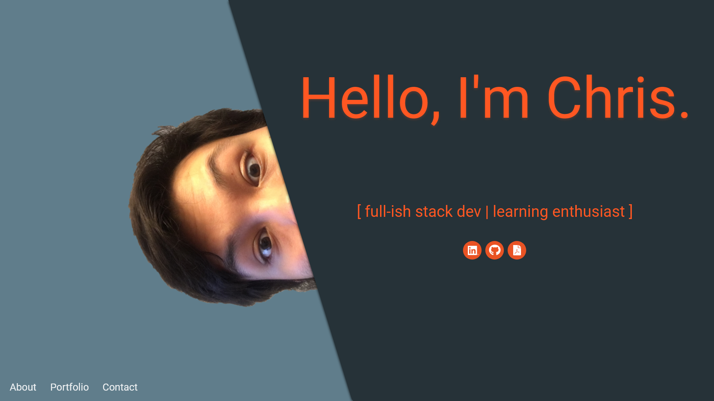
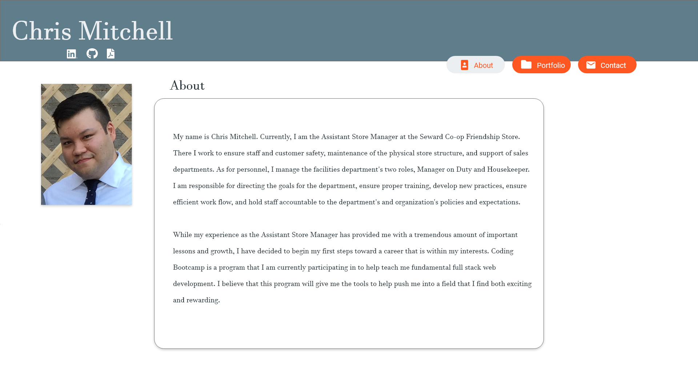
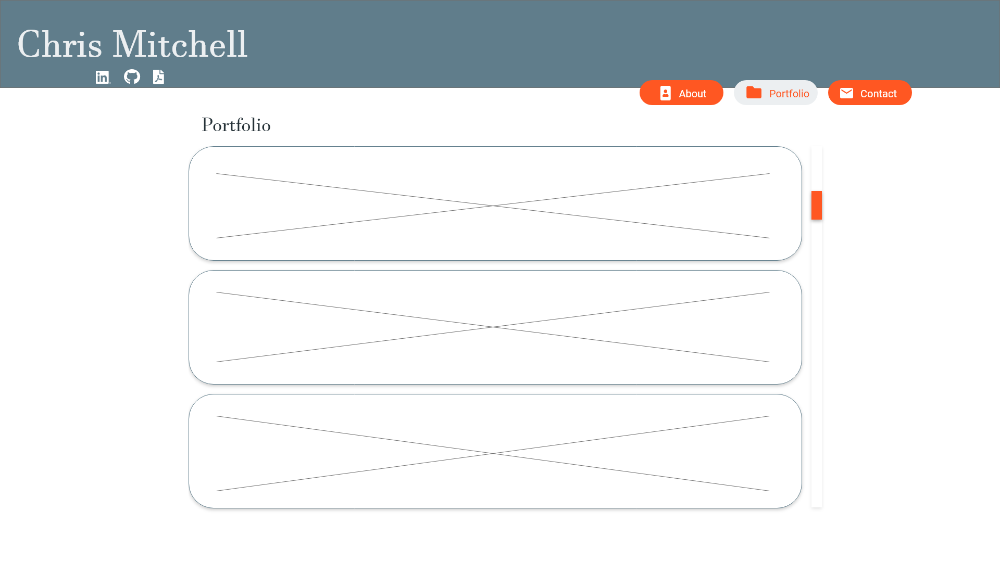
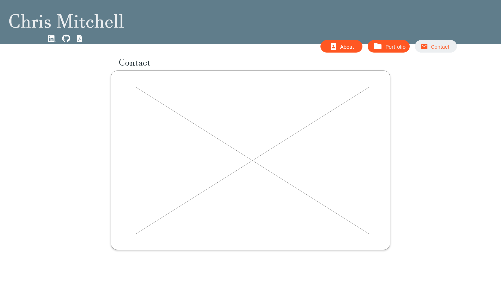
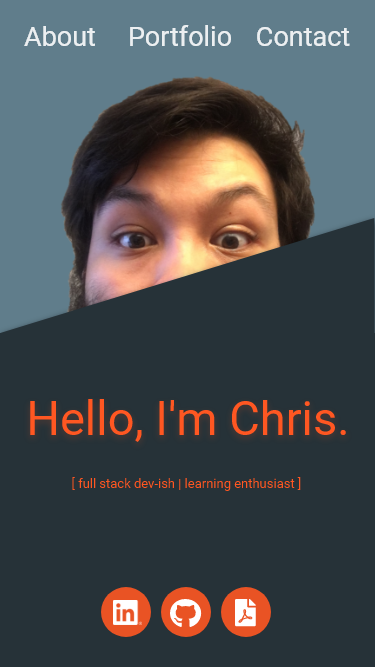
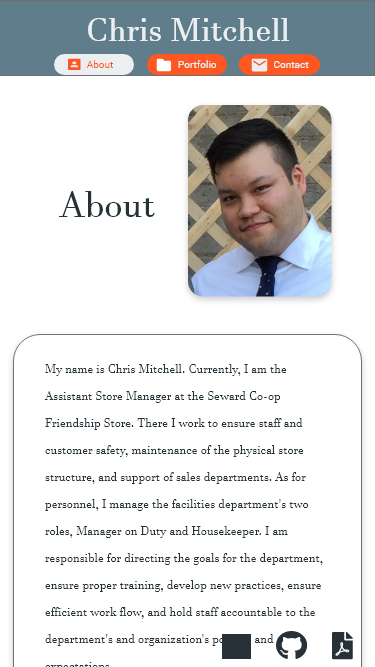
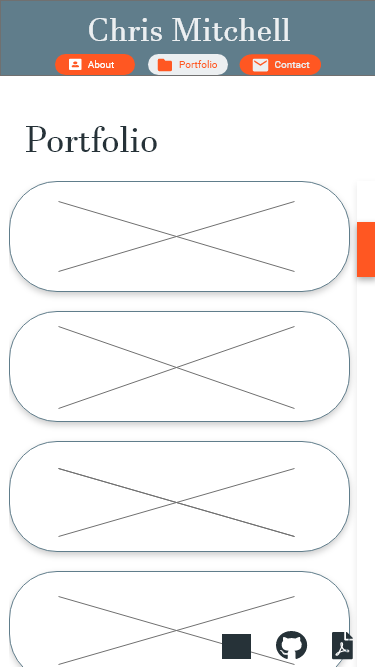
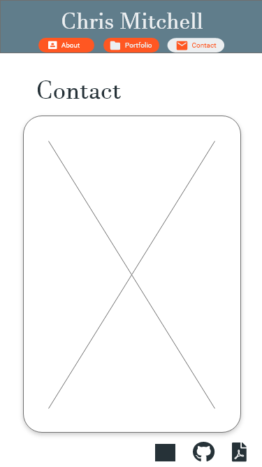

# Chris Mitchell Portfolio

My newest updated portfolio.

## To-do
*   Add responsiveness to the pages so that phone viewports don't look so gross. Mockups were made and are below.
*   Make the form actually work.

# Build Process
## **Design**

Utilizing Adobe XD, I was able to make a mockup of the portfolio. This is the first time using Adobe XD and what I've found is that it really helps visualize the whole project (*duh*) and allows you to make minor adjustments to the design instead of designing a whole website in code as you go. I also used [Material](https://material.io/) to help with design tips.

I have all of the images for the pages within the mockup below. The webpage - as it was being built - evolved into a newer design as I went along.

I wasn't able to get to the responsiveness for the site yet; however, I do have a link to the way it should look and prototyped for function. You can click the link below to check it out, leave a comment too if you'd like! Keep in mind, you need an Adobe account in order to see the project.

[Adobe XD: Mobile Prototype Mockup](https://xd.adobe.com/view/9a13cc3a-2bc9-4111-5150-65a56520089f-ec22/)

## **Build**

Building was pretty much using a whole lot of bootstrap grid trial-and-error to try and match the design. I was able to accomplish this but still ended up making a few more adjustments to the design as I went along. I did try to experiment a bit with *materialize* but time wasn't going to allow me the chance as I am already much more familiar with bootstrap. So, I commented it out and went ahead with bootstrap.

The portfolio page was pretty fun to build. I decided to put all of my different projects into a JavaScript object to make it easier on myself to add more to the portfolio. When adding the projects to the old bootstrap assignment portfolio, it was a whole lot of html. Not to mention, I only had slots for 6 - adding more would have ment copy/pasting code and lining it all up again. Now, I just add a name, link, image, and description, and JavaScript will do all the rest for me (virtually endlessly)!

## **Future**

I intend to keep going on this page. First, I want to make sure that the site is responsive. Second, I need to learn how to add actual email functionality to the page so that I don't have an alert that says that it's under construction. I think that's still a little bit down the road though. For now, an alert will have to suffice.

### Landing Page

Started as a joke to put a picture of myself peeking over the title box... Then my friend said it was great when I showed it to them... So I cleaned it up and made it my front page!

### About Page

### Portfolio Page

### Contact Page

### Mobile Versions

The black square in the bottom right is supposed to be the LinkedIn logo.

               

Thanks for reading, as a reward, here is a cat image!

